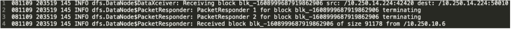
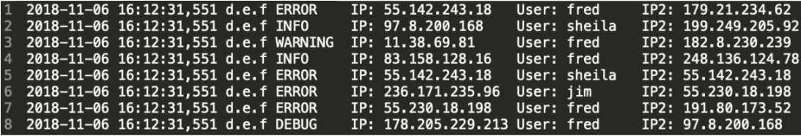

# Loggraph
Automatic generation of graphs from log files

# Table of contents

1. [Background](#Background)
2. [How to run](#how-to-run)
## Background
First, we describe some log files of interest, then describe the tool. 
### Giraph graphs:
The graph engine Giraph ingests graph in a list format: [source_id,source_value,[[dest_id, edge_value],...]].

### Graphs from HDFS logs:


Consider the use case of analyzing HDFS logs. Apache HDFS is a distributed file system designed to handle large data. A distributed system running algorithms on Hadoop with HDFS has an inherent graph structure produced by the block (data) transfers between nodes. For example, the first line in Fig. 1 has source (src) and destination (dest) IP/port. A python script scans each line for `src` and `dest` in the line and is considered as an edge from source to destination. Multiple occurences of an edge in the log file will result in a higher edge weights.

### PCAP graphs:
As another example, consider pcap logs. Pcap can capture network traffic and save it as a `.pcap` file. The IP Layer captured by PCAP can be used to create a meaningful graph of source IPs and destination IPs. Like in HDFS logs, we assign higher edge weights for multiple occurences of edges.

### Graph from any arbitrary log file:




To generate a random log for testing, we can leverage Python's Logging facility. For example, Fig. 2 shows a snippet of a random log file. This log file documents the day, time, user, type of error and IPs in question. A random log file might use any delimiter, but certain ones are more common

### Method:
We desire an approach that works on all of the above types of logs. We developed a tool that allows the user to specify which columns correspond to the nodes (and the infers edges). While this of course yields good results, it is a far cry from our goal of automation. We therefore also developed a rules-based approach.
This approach first predicts what delimiter a log file is using by checking for delimiters ',' ' ' '\t' ';' in that order. After the delimiter is predicted, we look for matching columns as follows, leveraging the fact that all nodes must be of the same “type.”
We compare the set of values in each column with the set of values in every other column, and look whether a set intersection between the columns will results in an intersection greater than a pre-selected threshold. A set intersection is performed by finding unique elements that are common in the two columns. If the intersection is higher than the threshold, we select the columns as nodes to generate a Giraph graph from it. We do this for each combination of column that has a set intersection size higher than the threshold.
In testing, this succeeded in perfectly handling all log files described above, including random log files generated for IP addresses, call records, and more. It is packaged it as a container.

## How to run

### Build docker container
`docker built -t logtogiraph .`

### Enter into the docker container
`docker run -it --entrypoint="/bin/bash" logtogiraph`

### Generating Giraph graph from HDF5 logs
`python hdfs-graph.py <hdf5_log_file>`

### Generating a random log file
```
cd random-log
python logexample.py
```

### Generating Giraph graphs from log files
```
cd random-log
python log-graph.py <random_log_filename>
```
